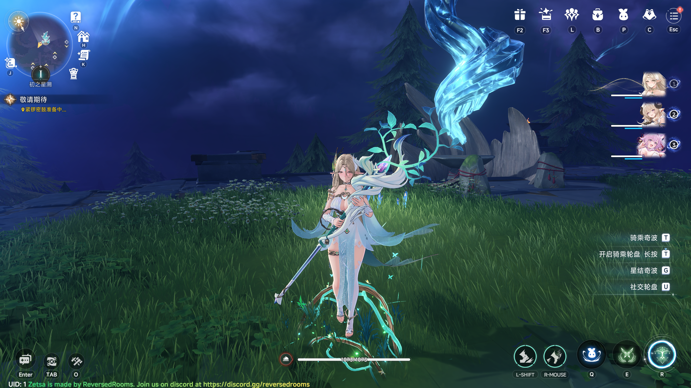

# Zetsa


Zetsa is an extremely efficient and minimalist server emulator for the game Azur Promilia.

Zetsa makes heavy use of `comptime` capabilities of the Zig programming language in order
to reduce the amount of possible runtime failures. This results in robust, optimal and reusable code.

We also maintain our own implementation of protobuf encoder/decoder,
as well as a replacement for protoc known as zetsa-proto-gen.

## Requirements
In order to build Zetsa you need:
- Zig Compiler, version `0.16.0`: [Linux](https://ziglang.org/download/0.16.0/zig-x86_64-linux-0.16.0.tar.xz)/[Windows](https://ziglang.org/download/0.16.0/zig-x86_64-windows-0.16.0.zip)

#### For additional help, you can join our [discord server](https://discord.xeondev.com)

## Installation
In short: clone the repository, run `zig build`, done.

### More precisely:
#### Linux
```sh
# Assuming you have git(1) installed.
git clone https://git.xeondev.com/zetsa/zetsa.git
cd zetsa
. ./envrc # The `envrc` script will setup the zig compiler for you.
zig build run-cdnsv &
zig build run-gamesv
```
#### Windows
```sh
# Assuming you're running this in powershell and have git(1) installed.
git clone https://git.xeondev.com/zetsa/zetsa.git
cd zetsa
./envrc.ps1 # The `envrc.ps1` script will setup the zig compiler for you.
Start-Process zig -ArgumentList "build run-cdnsv -Doptimize=ReleaseSmall" -NoNewWindow; zig build run-gamesv -Doptimize=ReleaseSmall
```

## Running
You have to run 2 binaries, zetsa-cdnsv and zetsa-gamesv.

The build script defines build steps for compiling and running both of the servers,
these can be used this way: `zig build run-cdnsv` (for cdnsv) `zig build run-gamesv` (for gamesv).

## Configuration
The configuration of Zetsa is done by editing the `cdnsv/config.zon` and
`gamesv/config.zon` and (re)compiling the source code.

Some of the server behavior can be also overridden through command line options.

## Persistence
The persistent player data is stored under the `store` directory,
which will be created upon first login.

## Connecting
First of all, you have to obtain a compatible game client,
the current supported version is CB2, you can find it in our [discord server](https://discord.xeondev.com).
Next, you have to apply the client patch: [evergreen](https://git.xeondev.com/zetsa/evergreen); follow its repository instructions.

## Contributing
[Donate](https://boosty.to/xeondev/donate).

[Join our discord server](https://discord.xeondev.com).

[Join our telegram channel](https://t.me/reversedrooms).

You can submit your changes in form of a diff file by opening a ticket
in our discord server in the `contributing` channel. In case you decide to contribute
on a regular basis, you can get an account on [our git instance](https://git.xeondev.com/).

